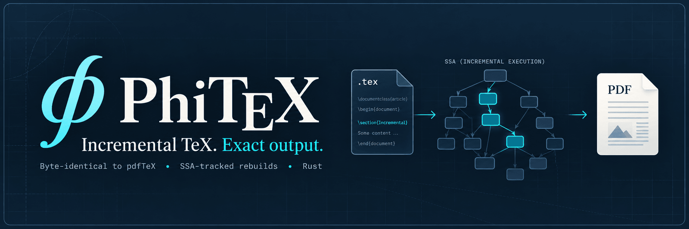

  

  
  
  
  
  
  

# PhiTeX

A TeX engine in Rust that compiles a LaTeX document incrementally. A cold
build produces exactly what pdfTeX produces, byte for byte. After that, an
edit re-runs only the parts of the job it can affect, and its output is
still byte-identical to a fresh pdfTeX run.

The engine records the job as a program in SSA form (dynamic single
assignment). Each run of a piece of the job is a *step*. A step records
what it read and what it defined, so an edit re-runs exactly the steps
whose inputs changed. The files the job writes and reads back (`.aux`,
`.toc`, `.bbl`, ...) live inside the build, and BibTeX and makeindex are
steps of it, so a build settles in one process with no separate passes.

## Status

- **Exactness:** the PDF is byte-identical to pdfTeX 1.40 (pdflatex), for
  a cold build and after every edit. That includes `\write18` (minted) and
  BibTeX/makeindex. The `.log` may differ.
- **Speed:** a word edit in a 64-page thesis rebuilds in about 10 ms
  natively. A cold tracked build takes about 2x a plain run.
- **Engines:** pdfTeX and TeX only; there is no XeTeX or LuaTeX.

## Layout

| Crate | What it is |
|---|---|
| `partex-engine`, `partex-core` | the engine: `tex.web`, e-TeX and pdfTeX, the PDF/DVI writers, and the SSA build and rebuild (`partex-core/src/ssa`) |
| `partex-ssa` | the SSA records: steps, slots, the fold of definitions |
| `partex-cli` | the `phitex` command |
| `partex-kpse` | kpathsea file lookup |
| `partex-bibtex`, `partex-makeindex` | BibTeX and makeindex, also as incremental build nodes |
| `phitex-syntax`, `phitex-ir`, `phitex-doc` | the source CST, the SSA text form, the static document layer |

`DESIGN.md` is the design and `AGENTS.md` the working rules.

## Building

Run every `cargo` command and built binary through `scripts/sandbox`
(bubblewrap: the repo is writable, `$HOME` is empty, and there is no
network unless `--net`):

    scripts/sandbox --net cargo fetch
    scripts/sandbox cargo build --release
    scripts/sandbox cargo test

`scripts/fetch-upstream.sh` fetches the pinned reference sources (TeX Live's
web2c, LaTeX, pgf) into `upstream/`. A TeX Live installation provides the
fonts and packages.

## Use

`phitex` builds a document to its fixpoint (BibTeX and makeindex
included), or watches it and rebuilds as it is edited:

    phitex build paper.tex
    phitex watch -o out paper.tex
    phitex clean paper.tex       # the outputs and what was saved: start over

Under an engine's name, or with `--compat`, it takes that engine's
command line:

    phitex --compat=pdftex -ini -jobname=pdflatex -translate-file=cp227.tcx '*pdflatex.ini'
    phitex --compat=pdftex -fmt=pdflatex -interaction=batchmode doc.tex

For an incremental build, set `PARTEX_SSA=1`. To keep rebuilding as the
sources change, use `-watch`.

## License

GNU Affero General Public License v3.0 only (`AGPL-3.0-only`); see `LICENSE`.

This license applies to every revision of this repository, including
those committed before `LICENSE` was added. The `license` field in
earlier revisions of `Cargo.toml` (`MIT OR Apache-2.0`, later
`AGPL-3.0-or-later`) was a placeholder and never licensed this code under
those terms.
